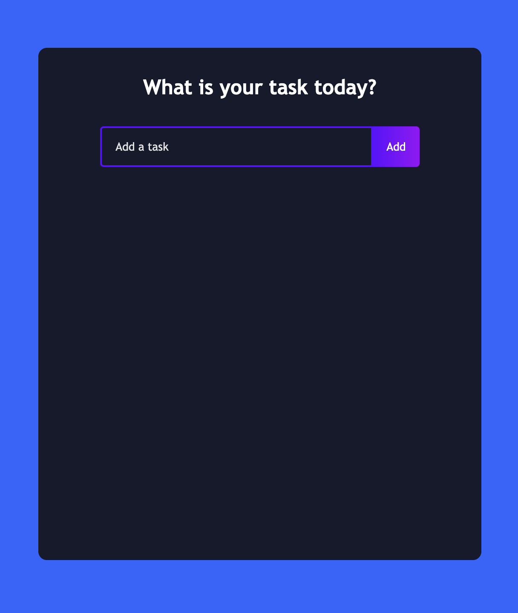
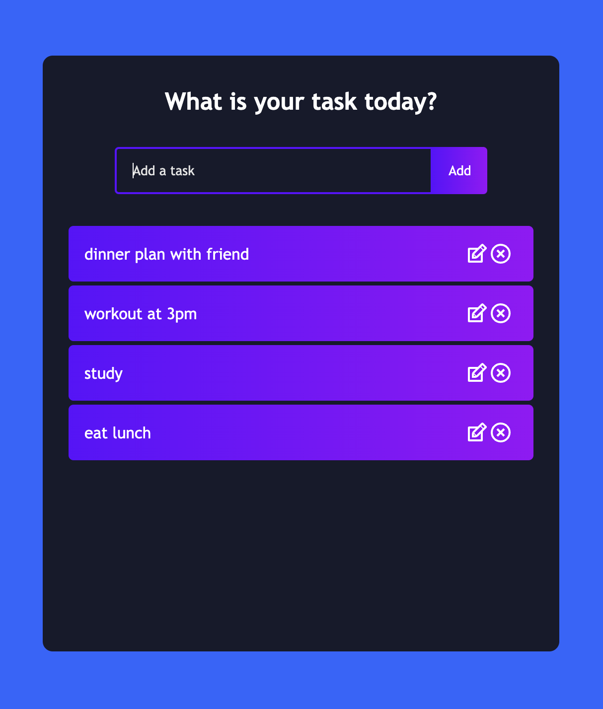

# About 
Todo List App 
- Users can Add/Edit/Update/Delete a task 

# Preview 
This is a preview image of the app when the list is empty. 


When the user adds todo tasks, the app looks like this. 


# Built With
- React
- JavaScript
- CSS 

# Installation 
1. Clone the repo
   ```sh
   git clone https://github.com/hyunjunghwang/todo-app.git
   ```
2. Install NPM packages
   ```sh
   npm install
   ```